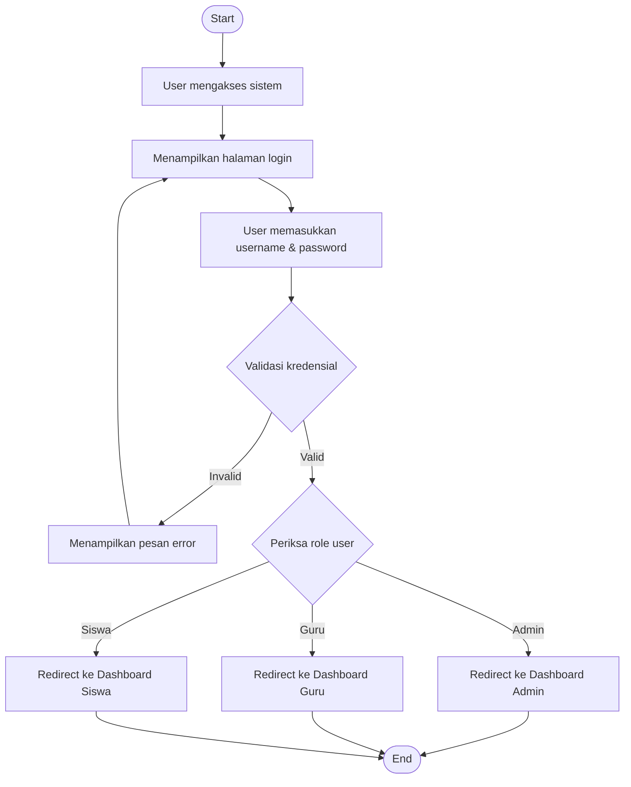
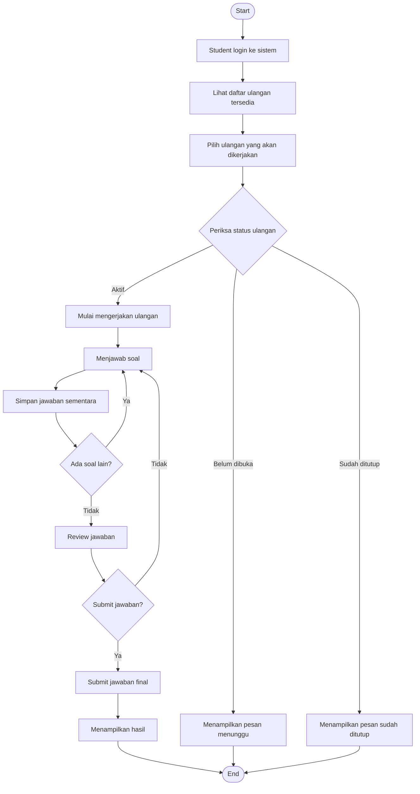
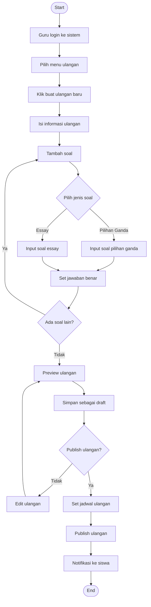
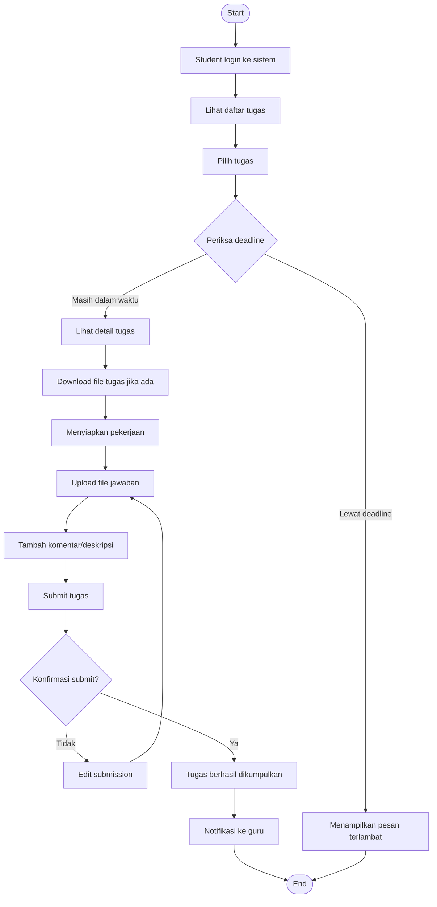
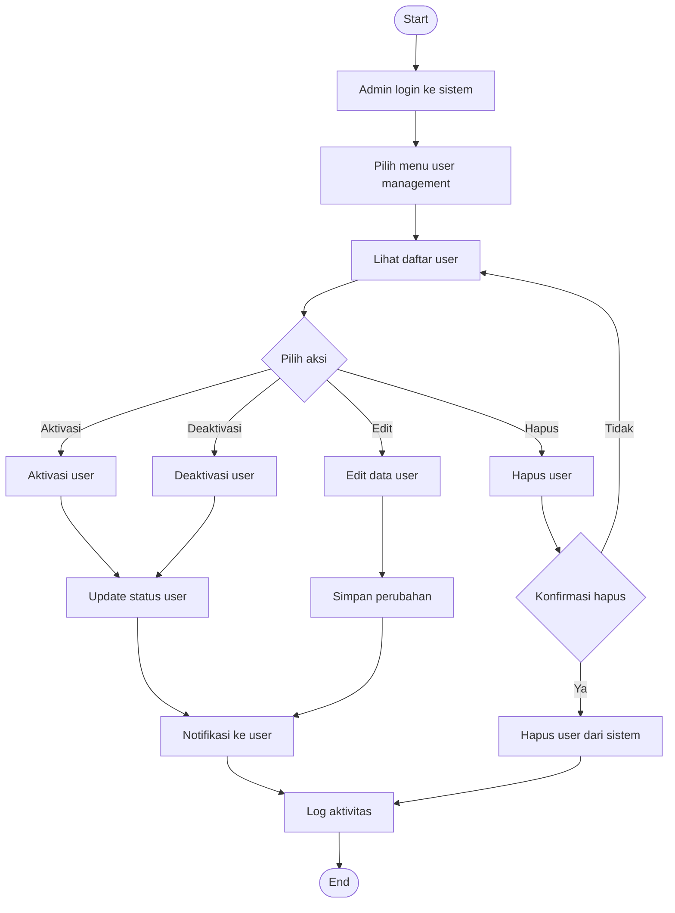
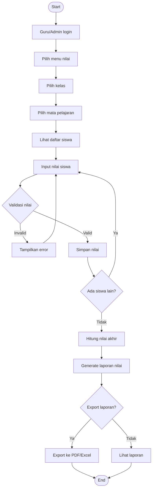

# Activity Diagram - E-Learning SMK

## 1. Activity Diagram - Login Process

## 2. Activity Diagram - Student Taking Online Exam

## 3. Activity Diagram - Teacher Creating Exam

## 4. Activity Diagram - Assignment Submission Process

## 5. Activity Diagram - Admin Managing Users

## 6. Activity Diagram - Grade Management Process

## Deskripsi Activity Diagram

### 1. Login Process
Menggambarkan alur login user dengan validasi kredensial dan redirect berdasarkan role.

### 2. Student Taking Online Exam
Menggambarkan proses siswa mengikuti ulangan online dari mulai login hingga melihat hasil.

### 3. Teacher Creating Exam
Menggambarkan proses guru membuat ulangan online dengan berbagai jenis soal.

### 4. Assignment Submission Process
Menggambarkan proses siswa mengumpulkan tugas dengan validasi deadline.

### 5. Admin Managing Users
Menggambarkan proses admin mengelola user (aktivasi, deaktivasi, edit, hapus).

### 6. Grade Management Process
Menggambarkan proses input dan pengelolaan nilai oleh guru/admin.
