# E-Learning SMK - Complete System Diagrams

## 1. Use Case Diagram

```mermaid
graph TB
    %% Actors
    Admin[👨‍💼 Admin]
    Guru[👨‍🏫 Guru]
    Siswa[👨‍🎓 Siswa]
    
    %% System Boundary
    subgraph "E-Learning SMK System"
        %% Admin Use Cases
        subgraph "Admin Functions"
            UC1[User Activation]
            UC2[User Management]
            UC3[System Settings]
            UC4[Data Master Management]
            UC5[Student Data Management]
            UC6[Teacher Data Management]
            UC7[Class Management]
            UC8[Schedule Management]
            UC9[Attendance Management]
            UC10[Grade Management]
            UC11[Exam Management]
            UC12[Material Management]
            UC13[Assignment Management]
            UC14[Academic Year Management]
        end
        
        %% Guru Use Cases
        subgraph "Teacher Functions"
            UC15[View Student Data]
            UC16[View Class Data]
            UC17[Attendance Management]
            UC18[Grade Input]
            UC19[Create Online Exam]
            UC20[Material Management]
            UC21[Assignment Management]
            UC22[View Exam Results]
        end
        
        %% Siswa Use Cases
        subgraph "Student Functions"
            UC23[View Schedule]
            UC24[View Grades]
            UC25[Take Online Exam]
            UC26[View Materials]
            UC27[Submit Assignments]
            UC28[View Exam Results]
        end
        
        %% Common Use Cases
        subgraph "Common Functions"
            UC29[Login]
            UC30[Register]
            UC31[Logout]
            UC32[Profile Management]
        end
    end
    
    %% Admin Relationships
    Admin --> UC1
    Admin --> UC2
    Admin --> UC3
    Admin --> UC4
    Admin --> UC5
    Admin --> UC6
    Admin --> UC7
    Admin --> UC8
    Admin --> UC9
    Admin --> UC10
    Admin --> UC11
    Admin --> UC12
    Admin --> UC13
    Admin --> UC14
    Admin --> UC29
    Admin --> UC31
    Admin --> UC32
    
    %% Guru Relationships
    Guru --> UC15
    Guru --> UC16
    Guru --> UC17
    Guru --> UC18
    Guru --> UC19
    Guru --> UC20
    Guru --> UC21
    Guru --> UC22
    Guru --> UC29
    Guru --> UC31
    Guru --> UC32
    
    %% Siswa Relationships
    Siswa --> UC23
    Siswa --> UC24
    Siswa --> UC25
    Siswa --> UC26
    Siswa --> UC27
    Siswa --> UC28
    Siswa --> UC29
    Siswa --> UC30
    Siswa --> UC31
    Siswa --> UC32
```



## 2. Activity Diagram - Login Process


## 3. Context Diagram

```mermaid
graph TB
    %% External Entities
    Admin[👨‍💼 Admin<br/>Sekolah]
    Guru[👨‍🏫 Guru<br/>Pengajar]
    Siswa[👨‍🎓 Siswa<br/>Peserta Didik]
    KepalaSekolah[👨‍💼 Kepala<br/>Sekolah]
    OrangTua[👨‍👩‍👧‍👦 Orang Tua<br/>Wali]
    SistemAkademik[📊 Sistem<br/>Akademik<br/>Eksternal]
    
    %% Central System
    subgraph "E-Learning SMK System"
        ELearning[🎓 E-Learning<br/>SMK System]
    end
    
    %% Data Flows - Admin
    Admin -->|"1. Login Request"| ELearning
    ELearning -->|"2. Dashboard Data"| Admin
    Admin -->|"3. User Management"| ELearning
    ELearning -->|"4. User Status Update"| Admin
    
    %% Data Flows - Guru
    Guru -->|"5. Login Request"| ELearning
    ELearning -->|"6. Teaching Dashboard"| Guru
    Guru -->|"7. Material Upload"| ELearning
    ELearning -->|"8. Upload Confirmation"| Guru
    
    %% Data Flows - Siswa
    Siswa -->|"9. Login Request"| ELearning
    ELearning -->|"10. Student Dashboard"| Siswa
    Siswa -->|"11. View Materials"| ELearning
    ELearning -->|"12. Material Files"| Siswa
    
    %% Styling
    classDef external fill:#e1f5fe,stroke:#01579b,stroke-width:2px
    classDef system fill:#f3e5f5,stroke:#4a148c,stroke-width:3px
    
    class Admin,Guru,Siswa,KepalaSekolah,OrangTua,SistemAkademik external
    class ELearning system
```



## 4. Hierarchical Diagram - Level 1


## 5. DAD Level 1

```mermaid
graph TD
    %% External Entities
    Admin[👨‍💼 Admin]
    Guru[👨‍🏫 Guru]
    Siswa[👨‍🎓 Siswa]
    
    %% Processes
    subgraph "E-Learning SMK System"
        P1[1.0<br/>Authentication<br/>Process]
        P2[2.0<br/>User Management<br/>Process]
        P3[3.0<br/>Learning Content<br/>Management]
        P4[4.0<br/>Assessment<br/>Management]
        P5[5.0<br/>Grade & Progress<br/>Management]
        P6[6.0<br/>System Administration<br/>Process]
    end
    
    %% Data Stores
    D1[(D1: User Database)]
    D2[(D2: Learning Content<br/>Database)]
    D3[(D3: Assessment<br/>Database)]
    D4[(D4: Grade Database)]
    D5[(D5: System Configuration<br/>Database)]
    D6[(D6: File Storage)]
    
    %% Admin Flows
    Admin -->|"Login Request"| P1
    P1 -->|"Authentication Response"| Admin
    Admin -->|"User Management Request"| P2
    P2 -->|"User Management Response"| Admin
    
    %% Guru Flows
    Guru -->|"Login Request"| P1
    P1 -->|"Authentication Response"| Guru
    Guru -->|"Content Management Request"| P3
    P3 -->|"Content Management Response"| Guru
    
    %% Siswa Flows
    Siswa -->|"Login Request"| P1
    P1 -->|"Authentication Response"| Siswa
    Siswa -->|"Content Access Request"| P3
    P3 -->|"Content Access Response"| Siswa
    
    %% Process to Data Store Flows
    P1 <-->|"User Data"| D1
    P2 <-->|"User Data"| D1
    P3 <-->|"Content Data"| D2
    P3 <-->|"File Data"| D6
    P4 <-->|"Assessment Data"| D3
    P5 <-->|"Grade Data"| D4
    P6 <-->|"Config Data"| D5
    
    %% Styling
    classDef external fill:#e1f5fe,stroke:#01579b,stroke-width:2px
    classDef process fill:#f3e5f5,stroke:#4a148c,stroke-width:2px
    classDef datastore fill:#e8f5e8,stroke:#2e7d32,stroke-width:2px
    
    class Admin,Guru,Siswa external
    class P1,P2,P3,P4,P5,P6 process
    class D1,D2,D3,D4,D5,D6 datastore
```



## 6. DAD Level 2 - Authentication Process

```mermaid
graph TD
    %% External Entities
    User[👤 User<br/>(Admin/Guru/Siswa)]
    
    %% Sub-processes
    subgraph "1.0 Authentication Process"
        P1_1[1.1<br/>Validate<br/>Credentials]
        P1_2[1.2<br/>Check User<br/>Status]
        P1_3[1.3<br/>Generate<br/>Session]
        P1_4[1.4<br/>Set User<br/>Permissions]
    end
    
    %% Data Stores
    D1[(D1: User Database)]
    D7[(D7: Session Database)]
    
    %% Flows
    User -->|"Username & Password"| P1_1
    P1_1 -->|"User Data Request"| D1
    D1 -->|"User Data"| P1_1
    P1_1 -->|"Validated User"| P1_2
    P1_2 -->|"User Status Check"| D1
    D1 -->|"User Status"| P1_2
    P1_2 -->|"Active User"| P1_3
    P1_3 -->|"Session Data"| D7
    D7 -->|"Session Created"| P1_3
    P1_3 -->|"Session Info"| P1_4
    P1_4 -->|"Permission Data"| D1
    D1 -->|"User Permissions"| P1_4
    P1_4 -->|"Login Success"| User
    
    %% Styling
    classDef external fill:#e1f5fe,stroke:#01579b,stroke-width:2px
    classDef process fill:#f3e5f5,stroke:#4a148c,stroke-width:2px
    classDef datastore fill:#e8f5e8,stroke:#2e7d32,stroke-width:2px
    
    class User external
    class P1_1,P1_2,P1_3,P1_4 process
    class D1,D7 datastore
```

## 7. ERD (Entity Relationship Diagram)


## Summary

Dokumen ini berisi semua diagram sistem E-Learning SMK:

1. **Use Case Diagram**: Menunjukkan interaksi antara aktor (Admin, Guru, Siswa) dengan sistem
2. **Activity Diagram**: Menggambarkan alur proses login dalam sistem
3. **Context Diagram**: Menunjukkan sistem dalam konteks lingkungan eksternal
4. **Hierarchical Diagram**: Struktur modul sistem secara berjenjang
5. **DAD Level 1**: Data Flow Diagram tingkat pertama
6. **DAD Level 2**: Data Flow Diagram tingkat kedua (detail proses authentication)
7. **ERD**: Entity Relationship Diagram yang menunjukkan struktur database

Semua diagram dibuat menggunakan Mermaid syntax dan dapat di-render dalam berbagai format.
