# Diagram Konteks - E-Learning SMK

```mermaid
graph TB
    %% External Entities
    Admin[👨‍💼 Admin<br/>Sekolah]
    Guru[👨‍🏫 Guru<br/>Pengajar]
    Siswa[👨‍🎓 Siswa<br/>Peserta Didik]
    KepalaSekolah[👨‍💼 Kepala<br/>Sekolah]
    OrangTua[👨‍👩‍👧‍👦 Orang Tua<br/>Wali]
    SistemAkademik[📊 Sistem<br/>Akademik<br/>Eksternal]
    
    %% Central System
    subgraph "E-Learning SMK System"
        ELearning[🎓 E-Learning<br/>SMK System]
    end
    
    %% Data Flows - Admin
    Admin -->|"1. Login Request"| ELearning
    ELearning -->|"2. Dashboard Data"| Admin
    Admin -->|"3. User Management"| ELearning
    ELearning -->|"4. User Status Update"| Admin
    Admin -->|"5. System Configuration"| ELearning
    ELearning -->|"6. Configuration Response"| Admin
    Admin -->|"7. Master Data Input"| ELearning
    ELearning -->|"8. Data Validation"| Admin
    
    %% Data Flows - Guru
    Guru -->|"9. Login Request"| ELearning
    ELearning -->|"10. Teaching Dashboard"| Guru
    Guru -->|"11. Material Upload"| ELearning
    ELearning -->|"12. Upload Confirmation"| Guru
    Guru -->|"13. Exam Creation"| ELearning
    ELearning -->|"14. Exam Published"| Guru
    Guru -->|"15. Grade Input"| ELearning
    ELearning -->|"16. Grade Saved"| Guru
    Guru -->|"17. Attendance Record"| ELearning
    ELearning -->|"18. Attendance Report"| Guru
    
    %% Data Flows - Siswa
    Siswa -->|"19. Login Request"| ELearning
    ELearning -->|"20. Student Dashboard"| Siswa
    Siswa -->|"21. View Materials"| ELearning
    ELearning -->|"22. Material Files"| Siswa
    Siswa -->|"23. Take Exam"| ELearning
    ELearning -->|"24. Exam Questions"| Siswa
    Siswa -->|"25. Submit Answers"| ELearning
    ELearning -->|"26. Exam Results"| Siswa
    Siswa -->|"27. Submit Assignment"| ELearning
    ELearning -->|"28. Submission Confirmation"| Siswa
    Siswa -->|"29. View Grades"| ELearning
    ELearning -->|"30. Grade Report"| Siswa
    
    %% Data Flows - Kepala Sekolah
    KepalaSekolah -->|"31. Request Reports"| ELearning
    ELearning -->|"32. Academic Reports"| KepalaSekolah
    KepalaSekolah -->|"33. Policy Updates"| ELearning
    ELearning -->|"34. Policy Implementation"| KepalaSekolah
    
    %% Data Flows - Orang Tua
    OrangTua -->|"35. View Child Progress"| ELearning
    ELearning -->|"36. Student Progress Report"| OrangTua
    OrangTua -->|"37. Communication Request"| ELearning
    ELearning -->|"38. Communication Response"| OrangTua
    
    %% Data Flows - Sistem Akademik Eksternal
    SistemAkademik -->|"39. Student Data Sync"| ELearning
    ELearning -->|"40. Academic Data Export"| SistemAkademik
    SistemAkademik -->|"41. Curriculum Updates"| ELearning
    ELearning -->|"42. Update Confirmation"| SistemAkademik
    
    %% Styling
    classDef external fill:#e1f5fe,stroke:#01579b,stroke-width:2px
    classDef system fill:#f3e5f5,stroke:#4a148c,stroke-width:3px
    
    class Admin,Guru,Siswa,KepalaSekolah,OrangTua,SistemAkademik external
    class ELearning system
```

## Deskripsi Diagram Konteks

### External Entities (Entitas Eksternal)

1. **Admin Sekolah**
   - Mengelola sistem secara keseluruhan
   - Mengatur user dan konfigurasi sistem
   - Mengelola data master

2. **Guru/Pengajar**
   - Mengajar dan memberikan materi
   - Membuat dan mengelola ulangan
   - Input nilai dan absensi

3. **Siswa/Peserta Didik**
   - Mengakses materi pembelajaran
   - Mengikuti ulangan online
   - Mengumpulkan tugas

4. **Kepala Sekolah**
   - Memantau laporan akademik
   - Mengatur kebijakan sistem

5. **Orang Tua/Wali**
   - Memantau perkembangan anak
   - Berkomunikasi dengan sekolah

6. **Sistem Akademik Eksternal**
   - Sinkronisasi data siswa
   - Integrasi dengan sistem lain

### Data Flows (Alur Data)

#### Admin Flows (1-8)
- **1-2**: Login dan akses dashboard
- **3-4**: Manajemen user (aktivasi/deaktivasi)
- **5-6**: Konfigurasi sistem
- **7-8**: Input dan validasi data master

#### Guru Flows (9-18)
- **9-10**: Login dan dashboard mengajar
- **11-12**: Upload materi pembelajaran
- **13-14**: Pembuatan dan publikasi ulangan
- **15-16**: Input nilai siswa
- **17-18**: Pencatatan dan laporan absensi

#### Siswa Flows (19-30)
- **19-20**: Login dan dashboard siswa
- **21-22**: Akses materi pembelajaran
- **23-26**: Mengikuti ulangan online
- **27-28**: Pengumpulan tugas
- **29-30**: Melihat nilai dan laporan

#### Kepala Sekolah Flows (31-34)
- **31-32**: Permintaan dan penerimaan laporan
- **33-34**: Update kebijakan sistem

#### Orang Tua Flows (35-38)
- **35-36**: Monitoring perkembangan anak
- **37-38**: Komunikasi dengan sekolah

#### Sistem Eksternal Flows (39-42)
- **39-40**: Sinkronisasi data akademik
- **41-42**: Update kurikulum

### Central System
**E-Learning SMK System** adalah sistem pusat yang mengelola semua aktivitas pembelajaran online, termasuk:
- Manajemen user dan autentikasi
- Penyimpanan materi pembelajaran
- Sistem ulangan online
- Manajemen nilai dan absensi
- Laporan akademik
