# DAD Level 1 - E-Learning SMK

## Data Flow Diagram Level 1

```mermaid
graph TD
    %% External Entities
    Admin[👨‍💼 Admin]
    Guru[👨‍🏫 Guru]
    Siswa[👨‍🎓 Siswa]
    
    %% Processes
    subgraph "E-Learning SMK System"
        P1[1.0<br/>Authentication<br/>Process]
        P2[2.0<br/>User Management<br/>Process]
        P3[3.0<br/>Learning Content<br/>Management]
        P4[4.0<br/>Assessment<br/>Management]
        P5[5.0<br/>Grade & Progress<br/>Management]
        P6[6.0<br/>System Administration<br/>Process]
    end
    
    %% Data Stores
    D1[(D1: User Database)]
    D2[(D2: Learning Content<br/>Database)]
    D3[(D3: Assessment<br/>Database)]
    D4[(D4: Grade Database)]
    D5[(D5: System Configuration<br/>Database)]
    D6[(D6: File Storage)]
    
    %% Admin Flows
    Admin -->|"Login Request"| P1
    P1 -->|"Authentication Response"| Admin
    Admin -->|"User Management Request"| P2
    P2 -->|"User Management Response"| Admin
    Admin -->|"System Config Request"| P6
    P6 -->|"System Config Response"| Admin
    
    %% Guru Flows
    Guru -->|"Login Request"| P1
    P1 -->|"Authentication Response"| Guru
    Guru -->|"Content Management Request"| P3
    P3 -->|"Content Management Response"| Guru
    Guru -->|"Assessment Request"| P4
    P4 -->|"Assessment Response"| Guru
    Guru -->|"Grade Management Request"| P5
    P5 -->|"Grade Management Response"| Guru
    
    %% Siswa Flows
    Siswa -->|"Login Request"| P1
    P1 -->|"Authentication Response"| Siswa
    Siswa -->|"Content Access Request"| P3
    P3 -->|"Content Access Response"| Siswa
    Siswa -->|"Assessment Request"| P4
    P4 -->|"Assessment Response"| Siswa
    Siswa -->|"Progress Request"| P5
    P5 -->|"Progress Response"| Siswa
    
    %% Process to Data Store Flows
    P1 <-->|"User Data"| D1
    P2 <-->|"User Data"| D1
    P3 <-->|"Content Data"| D2
    P3 <-->|"File Data"| D6
    P4 <-->|"Assessment Data"| D3
    P4 <-->|"File Data"| D6
    P5 <-->|"Grade Data"| D4
    P6 <-->|"Config Data"| D5
    
    %% Inter-process Flows
    P1 -->|"User Validation"| P2
    P1 -->|"User Validation"| P3
    P1 -->|"User Validation"| P4
    P1 -->|"User Validation"| P5
    P1 -->|"User Validation"| P6
    P3 -->|"Content Status"| P4
    P4 -->|"Assessment Results"| P5
    P2 -->|"User Updates"| P3
    P2 -->|"User Updates"| P4
    P2 -->|"User Updates"| P5
    
    %% Styling
    classDef external fill:#e1f5fe,stroke:#01579b,stroke-width:2px
    classDef process fill:#f3e5f5,stroke:#4a148c,stroke-width:2px
    classDef datastore fill:#e8f5e8,stroke:#2e7d32,stroke-width:2px
    
    class Admin,Guru,Siswa external
    class P1,P2,P3,P4,P5,P6 process
    class D1,D2,D3,D4,D5,D6 datastore
```

## Deskripsi DAD Level 1

### External Entities (Entitas Eksternal)
1. **Admin**: Administrator sistem
2. **Guru**: Pengajar/guru
3. **Siswa**: Peserta didik

### Processes (Proses)
1. **1.0 Authentication Process**: Mengelola login, logout, dan validasi user
2. **2.0 User Management Process**: Mengelola data user (CRUD operations)
3. **3.0 Learning Content Management**: Mengelola materi pembelajaran
4. **4.0 Assessment Management**: Mengelola ulangan dan penilaian
5. **5.0 Grade & Progress Management**: Mengelola nilai dan progress siswa
6. **6.0 System Administration Process**: Mengelola konfigurasi sistem

### Data Stores (Penyimpanan Data)
1. **D1: User Database**: Menyimpan data user (admin, guru, siswa)
2. **D2: Learning Content Database**: Menyimpan data materi pembelajaran
3. **D3: Assessment Database**: Menyimpan data ulangan dan soal
4. **D4: Grade Database**: Menyimpan data nilai dan progress
5. **D5: System Configuration Database**: Menyimpan konfigurasi sistem
6. **D6: File Storage**: Menyimpan file-file (materi, tugas, dll)

### Data Flows (Alur Data)

#### Input Flows (Masukan)
- **Login Request**: Permintaan login dari user
- **User Management Request**: Permintaan manajemen user dari admin
- **Content Management Request**: Permintaan manajemen konten dari guru
- **Assessment Request**: Permintaan assessment dari guru/siswa
- **Grade Management Request**: Permintaan manajemen nilai dari guru
- **System Config Request**: Permintaan konfigurasi sistem dari admin

#### Output Flows (Keluaran)
- **Authentication Response**: Respons autentikasi ke user
- **User Management Response**: Respons manajemen user ke admin
- **Content Management Response**: Respons manajemen konten ke guru
- **Assessment Response**: Respons assessment ke guru/siswa
- **Grade Management Response**: Respons manajemen nilai ke guru
- **System Config Response**: Respons konfigurasi sistem ke admin

#### Internal Flows (Alur Internal)
- **User Data**: Data user antara proses dan database
- **Content Data**: Data konten pembelajaran
- **Assessment Data**: Data ulangan dan soal
- **Grade Data**: Data nilai dan progress
- **Config Data**: Data konfigurasi sistem
- **File Data**: Data file dan dokumen

#### Inter-process Flows (Alur Antar Proses)
- **User Validation**: Validasi user dari authentication ke proses lain
- **Content Status**: Status konten dari content management ke assessment
- **Assessment Results**: Hasil assessment ke grade management
- **User Updates**: Update user dari user management ke proses lain

### Key Features
1. **Centralized Authentication**: Semua proses memerlukan validasi dari authentication process
2. **Role-based Access**: Setiap user memiliki akses berbeda berdasarkan role
3. **Integrated Data Flow**: Data mengalir antar proses sesuai kebutuhan
4. **File Management**: Sistem terintegrasi dengan file storage
5. **Real-time Updates**: Perubahan data langsung terupdate ke semua proses terkait
