# DAD Level 2 - E-Learning SMK

## DAD Level 2 - Detailed Process Breakdown

### 1. Authentication Process (1.0) - Detailed

```mermaid
graph TD
    %% External Entities
    User[👤 User<br/>(Admin/Guru/Siswa)]
    
    %% Sub-processes
    subgraph "1.0 Authentication Process"
        P1_1[1.1<br/>Validate<br/>Credentials]
        P1_2[1.2<br/>Check User<br/>Status]
        P1_3[1.3<br/>Generate<br/>Session]
        P1_4[1.4<br/>Set User<br/>Permissions]
    end
    
    %% Data Stores
    D1[(D1: User Database)]
    D7[(D7: Session Database)]
    
    %% Flows
    User -->|"Username & Password"| P1_1
    P1_1 -->|"User Data Request"| D1
    D1 -->|"User Data"| P1_1
    P1_1 -->|"Validated User"| P1_2
    P1_2 -->|"User Status Check"| D1
    D1 -->|"User Status"| P1_2
    P1_2 -->|"Active User"| P1_3
    P1_3 -->|"Session Data"| D7
    D7 -->|"Session Created"| P1_3
    P1_3 -->|"Session Info"| P1_4
    P1_4 -->|"Permission Data"| D1
    D1 -->|"User Permissions"| P1_4
    P1_4 -->|"Login Success"| User
    
    %% Styling
    classDef external fill:#e1f5fe,stroke:#01579b,stroke-width:2px
    classDef process fill:#f3e5f5,stroke:#4a148c,stroke-width:2px
    classDef datastore fill:#e8f5e8,stroke:#2e7d32,stroke-width:2px
    
    class User external
    class P1_1,P1_2,P1_3,P1_4 process
    class D1,D7 datastore
```

### 2. User Management Process (2.0) - Detailed


### 3. Learning Content Management (3.0) - Detailed

```mermaid
graph TD
    %% External Entities
    Guru[👨‍🏫 Guru]
    Siswa[👨‍🎓 Siswa]
    
    %% Sub-processes
    subgraph "3.0 Learning Content Management"
        P3_1[3.1<br/>Create/<br/>Upload Material]
        P3_2[3.2<br/>Edit/<br/>Update Material]
        P3_3[3.3<br/>Delete<br/>Material]
        P3_4[3.4<br/>Access<br/>Material]
        P3_5[3.5<br/>Download<br/>Material]
        P3_6[3.6<br/>Share<br/>Material]
    end
    
    %% Data Stores
    D2[(D2: Learning Content<br/>Database)]
    D6[(D6: File Storage)]
    D9[(D9: Access Log)]
    
    %% Guru Flows
    Guru -->|"Material Data"| P3_1
    P3_1 -->|"Content Data"| D2
    P3_1 -->|"File Data"| D6
    D2 -->|"Material Created"| P3_1
    D6 -->|"File Uploaded"| P3_1
    P3_1 -->|"Creation Log"| D9
    
    Guru -->|"Updated Material"| P3_2
    P3_2 -->|"Content Update"| D2
    P3_2 -->|"File Update"| D6
    D2 -->|"Material Updated"| P3_2
    P3_2 -->|"Update Log"| D9
    
    Guru -->|"Delete Request"| P3_3
    P3_3 -->|"Content Deletion"| D2
    P3_3 -->|"File Deletion"| D6
    P3_3 -->|"Deletion Log"| D9
    
    %% Siswa Flows
    Siswa -->|"Access Request"| P3_4
    P3_4 -->|"Content Query"| D2
    D2 -->|"Material Data"| P3_4
    P3_4 -->|"Access Log"| D9
    P3_4 -->|"Material List"| Siswa
    
    Siswa -->|"Download Request"| P3_5
    P3_5 -->|"File Request"| D6
    D6 -->|"File Data"| P3_5
    P3_5 -->|"Download Log"| D9
    P3_5 -->|"File Download"| Siswa
    
    Guru -->|"Share Request"| P3_6
    P3_6 -->|"Share Settings"| D2
    D2 -->|"Share Updated"| P3_6
    P3_6 -->|"Share Log"| D9
    
    %% Styling
    classDef external fill:#e1f5fe,stroke:#01579b,stroke-width:2px
    classDef process fill:#f3e5f5,stroke:#4a148c,stroke-width:2px
    classDef datastore fill:#e8f5e8,stroke:#2e7d32,stroke-width:2px
    
    class Guru,Siswa external
    class P3_1,P3_2,P3_3,P3_4,P3_5,P3_6 process
    class D2,D6,D9 datastore
```



### 4. Assessment Management (4.0) - Detailed

```mermaid
graph TD
    %% External Entities
    Guru[👨‍🏫 Guru]
    Siswa[👨‍🎓 Siswa]
    
    %% Sub-processes
    subgraph "4.0 Assessment Management"
        P4_1[4.1<br/>Create<br/>Exam]
        P4_2[4.2<br/>Add<br/>Questions]
        P4_3[4.3<br/>Schedule<br/>Exam]
        P4_4[4.4<br/>Publish/<br/>Close Exam]
        P4_5[4.5<br/>Take<br/>Exam]
        P4_6[4.6<br/>Submit<br/>Answers]
        P4_7[4.7<br/>Grade<br/>Exam]
        P4_8[4.8<br/>View<br/>Results]
    end
    
    %% Data Stores
    D3[(D3: Assessment<br/>Database)]
    D10[(D10: Answer<br/>Database)]
    D11[(D11: Result<br/>Database)]
    
    %% Guru Flows
    Guru -->|"Exam Data"| P4_1
    P4_1 -->|"Exam Creation"| D3
    D3 -->|"Exam Created"| P4_1
    
    Guru -->|"Question Data"| P4_2
    P4_2 -->|"Question Addition"| D3
    D3 -->|"Question Added"| P4_2
    
    Guru -->|"Schedule Data"| P4_3
    P4_3 -->|"Schedule Update"| D3
    D3 -->|"Schedule Updated"| P4_3
    
    Guru -->|"Publish Request"| P4_4
    P4_4 -->|"Status Update"| D3
    D3 -->|"Status Updated"| P4_4
    
    %% Siswa Flows
    Siswa -->|"Exam Access"| P4_5
    P4_5 -->|"Exam Query"| D3
    D3 -->|"Exam Data"| P4_5
    P4_5 -->|"Exam Questions"| Siswa
    
    Siswa -->|"Answer Data"| P4_6
    P4_6 -->|"Answer Storage"| D10
    D10 -->|"Answer Saved"| P4_6
    
    %% System Flows
    P4_6 -->|"Answer Data"| P4_7
    P4_7 -->|"Grading Process"| D10
    D10 -->|"Answers"| P4_7
    P4_7 -->|"Results"| D11
    D11 -->|"Results Stored"| P4_7
    
    Guru -->|"Result Request"| P4_8
    Siswa -->|"Result Request"| P4_8
    P4_8 -->|"Result Query"| D11
    D11 -->|"Results"| P4_8
    P4_8 -->|"Exam Results"| Guru
    P4_8 -->|"Exam Results"| Siswa
    
    %% Styling
    classDef external fill:#e1f5fe,stroke:#01579b,stroke-width:2px
    classDef process fill:#f3e5f5,stroke:#4a148c,stroke-width:2px
    classDef datastore fill:#e8f5e8,stroke:#2e7d32,stroke-width:2px
    
    class Guru,Siswa external
    class P4_1,P4_2,P4_3,P4_4,P4_5,P4_6,P4_7,P4_8 process
    class D3,D10,D11 datastore
```



### 5. Grade & Progress Management (5.0) - Detailed

```mermaid
graph TD
    %% External Entities
    Guru[👨‍🏫 Guru]
    Siswa[👨‍🎓 Siswa]
    Admin[👨‍💼 Admin]
    
    %% Sub-processes
    subgraph "5.0 Grade & Progress Management"
        P5_1[5.1<br/>Input<br/>Grades]
        P5_2[5.2<br/>Calculate<br/>Final Grade]
        P5_3[5.3<br/>Generate<br/>Reports]
        P5_4[5.4<br/>Track<br/>Progress]
        P5_5[5.5<br/>Export<br/>Data]
    end
    
    %% Data Stores
    D4[(D4: Grade Database)]
    D11[(D11: Result Database)]
    D12[(D12: Progress Database)]
    
    %% Flows
    Guru -->|"Grade Data"| P5_1
    P5_1 -->|"Grade Storage"| D4
    D4 -->|"Grade Saved"| P5_1
    
    P5_1 -->|"Grade Data"| P5_2
    P5_2 -->|"Calculation Process"| D4
    D4 -->|"Grades"| P5_2
    P5_2 -->|"Final Grades"| D4
    
    Guru -->|"Report Request"| P5_3
    Admin -->|"Report Request"| P5_3
    P5_3 -->|"Data Query"| D4
    D4 -->|"Grade Data"| P5_3
    P5_3 -->|"Generated Report"| Guru
    P5_3 -->|"Generated Report"| Admin
    
    P5_2 -->|"Progress Data"| P5_4
    P5_4 -->|"Progress Tracking"| D12
    D12 -->|"Progress Stored"| P5_4
    
    Siswa -->|"Progress Request"| P5_4
    P5_4 -->|"Progress Query"| D12
    D12 -->|"Progress Data"| P5_4
    P5_4 -->|"Student Progress"| Siswa
    
    Guru -->|"Export Request"| P5_5
    Admin -->|"Export Request"| P5_5
    P5_5 -->|"Data Export"| D4
    D4 -->|"Export Data"| P5_5
    P5_5 -->|"Exported File"| Guru
    P5_5 -->|"Exported File"| Admin
    
    %% Styling
    classDef external fill:#e1f5fe,stroke:#01579b,stroke-width:2px
    classDef process fill:#f3e5f5,stroke:#4a148c,stroke-width:2px
    classDef datastore fill:#e8f5e8,stroke:#2e7d32,stroke-width:2px
    
    class Guru,Siswa,Admin external
    class P5_1,P5_2,P5_3,P5_4,P5_5 process
    class D4,D11,D12 datastore
```



## Deskripsi DAD Level 2

### Key Features of Level 2 DAD:

1. **Detailed Process Breakdown**: Setiap proses utama dipecah menjadi sub-proses yang lebih spesifik
2. **Additional Data Stores**: Menambahkan data store khusus seperti Session, Audit Log, Access Log, Answer Database, Result Database, dan Progress Database
3. **Specific Data Flows**: Alur data yang lebih detail dan spesifik untuk setiap operasi
4. **Role-based Access**: Setiap role memiliki akses yang berbeda terhadap proses tertentu
5. **Audit Trail**: Sistem logging untuk semua aktivitas penting
6. **Real-time Processing**: Proses yang berjalan secara real-time seperti grading dan progress tracking

### New Data Stores in Level 2:
- **D7: Session Database**: Menyimpan data session user
- **D8: Audit Log**: Menyimpan log aktivitas sistem
- **D9: Access Log**: Menyimpan log akses konten
- **D10: Answer Database**: Menyimpan jawaban ulangan
- **D11: Result Database**: Menyimpan hasil ulangan
- **D12: Progress Database**: Menyimpan data progress siswa

### Process Improvements:
1. **Authentication**: Lebih detail dengan session management
2. **User Management**: Termasuk audit logging
3. **Content Management**: Termasuk access logging dan sharing
4. **Assessment**: Proses yang lebih komprehensif dari creation hingga grading
5. **Grade Management**: Termasuk progress tracking dan reporting
