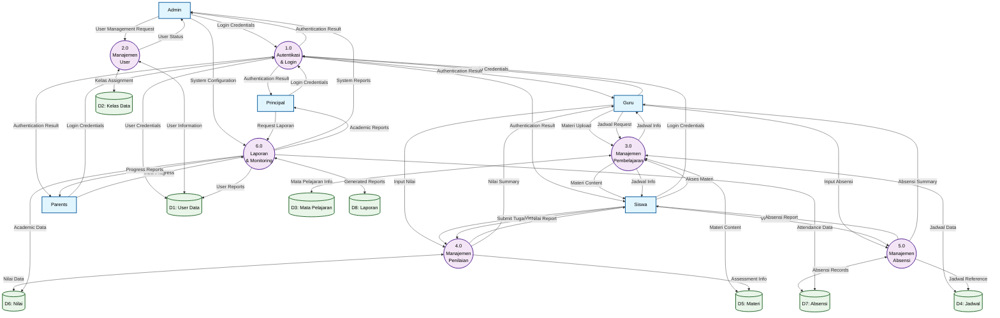

# DAD Level 1 - E-Learning SMK

## Deskripsi Proses Level 1

### 1.0 Autentikasi & Login
**Input**: Login credentials dari semua external entities
**Proses**: Validasi username/password, pengecekan role user, pemberian akses sesuai hak
**Output**: Authentication result (berhasil/gagal login)
**Data Store**: D1 (User Data)

### 2.0 Manajemen User  
**Input**: User management request dari Admin
**Proses**: CRUD operasi untuk data user (Admin, Guru, Siswa), assignment kelas
**Output**: User status confirmation
**Data Store**: D1 (User Data), D2 (Kelas Data)

### 3.0 Manajemen Pembelajaran
**Input**: 
- Materi upload dari Guru
- Jadwal request dari Guru  
- Akses materi dari Siswa
**Proses**: Upload/download materi, penjadwalan kelas, manajemen konten pembelajaran
**Output**: 
- Materi content untuk Siswa
- Jadwal info untuk Guru dan Siswa
**Data Store**: D3 (Mata Pelajaran), D4 (Jadwal), D5 (Materi)

### 4.0 Manajemen Penilaian
**Input**:
- Input nilai dari Guru
- Submit tugas dari Siswa
- View nilai request dari Siswa
**Proses**: Input dan kalkulasi nilai, manajemen tugas dan ujian, generate laporan nilai
**Output**:
- Nilai report untuk Siswa
- Nilai summary untuk Guru  
**Data Store**: D5 (Materi), D6 (Nilai)

### 5.0 Manajemen Absensi
**Input**:
- Input absensi dari Guru
- View absensi request dari Siswa
**Proses**: Pencatatan kehadiran siswa, kalkulasi persentase kehadiran
**Output**:
- Absensi report untuk Siswa
- Absensi summary untuk Guru
**Data Store**: D4 (Jadwal), D7 (Absensi)

### 6.0 Laporan & Monitoring
**Input**:
- System configuration dari Admin
- Request laporan dari Principal
- View progress dari Parents
**Proses**: Generate berbagai laporan sistem, monitoring aktivitas, analisis data
**Output**:
- System reports untuk Admin
- Academic reports untuk Principal  
- Progress reports untuk Parents
**Data Store**: D1 (User Data), D6 (Nilai), D7 (Absensi), D8 (Laporan)

## External Entities

### Admin
Administrator sistem yang mengelola konfigurasi sistem dan manajemen user

### Guru  
Pengajar yang mengelola pembelajaran, materi, penilaian, dan absensi

### Siswa
Peserta didik yang mengakses materi, mengerjakan tugas, dan melihat nilai serta absensi

### Principal
Kepala sekolah yang memantau dan mendapatkan laporan akademik

### Parents
Orang tua siswa yang memantau progress belajar anak

## Data Stores

- **D1: User Data** - Menyimpan informasi semua pengguna sistem
- **D2: Kelas Data** - Menyimpan informasi kelas dan penugasan siswa
- **D3: Mata Pelajaran** - Menyimpan data mata pelajaran yang diajarkan
- **D4: Jadwal** - Menyimpan jadwal pembelajaran
- **D5: Materi** - Menyimpan konten pembelajaran dan tugas
- **D6: Nilai** - Menyimpan data penilaian siswa
- **D7: Absensi** - Menyimpan data kehadiran siswa  
- **D8: Laporan** - Menyimpan laporan yang telah di-generate