# Diagram Berjenjang - E-Learning SMK

```mermaid
flowchart TD
    %% Level 0 - System Overview
    A[Sistem Informasi<br/>E-Learning SMK]
    
    %% Level 1 - Main Modules
    A --> B[Modul<br/>Autentikasi]
    A --> C[Modul<br/>Pembelajaran]
    A --> D[Modul<br/>Penilaian]
    A --> E[Modul<br/>Laporan]
    
    %% Level 2 - Sub Modules for Authentication
    B --> B1[Login<br/>System]
    B --> B2[User<br/>Management]
    B --> B3[Role<br/>Management]
    
    %% Level 2 - Sub Modules for Learning
    C --> C1[Manajemen<br/>Materi]
    C --> C2[Manajemen<br/>Jadwal]
    C --> C3[Manajemen<br/>Kelas]
    C --> C4[Absensi<br/>Siswa]
    
    %% Level 2 - Sub Modules for Assessment
    D --> D1[Input<br/>Nilai]
    D --> D2[Manajemen<br/>Tugas]
    D --> D3[Ujian<br/>Online]
    
    %% Level 2 - Sub Modules for Reports
    E --> E1[Laporan<br/>Akademik]
    E --> E2[Laporan<br/>Kehadiran]
    E --> E3[Progress<br/>Siswa]
    
    %% Level 3 - Detailed Components for Learning Management
    C1 --> C1a[Upload<br/>File]
    C1 --> C1b[Download<br/>Materi]
    C1 --> C1c[Kategori<br/>Materi]
    
    C2 --> C2a[Buat<br/>Jadwal]
    C2 --> C2b[Edit<br/>Jadwal]
    C2 --> C2c[View<br/>Jadwal]
    
    C3 --> C3a[Data<br/>Kelas]
    C3 --> C3b[Assignment<br/>Siswa]
    C3 --> C3c[Kapasitas<br/>Kelas]
    
    %% Level 3 - Detailed Components for Assessment
    D1 --> D1a[Nilai<br/>Tugas]
    D1 --> D1b[Nilai<br/>UTS]
    D1 --> D1c[Nilai<br/>UAS]
    
    D2 --> D2a[Create<br/>Assignment]
    D2 --> D2b[Submit<br/>Assignment]
    D2 --> D2c[Grade<br/>Assignment]
    
    %% Level 3 - Detailed Components for Reports
    E1 --> E1a[Rekap<br/>Nilai]
    E1 --> E1b[Ranking<br/>Siswa]
    E1 --> E1c[Analisis<br/>Pembelajaran]
    
    E2 --> E2a[Rekap<br/>Absensi]
    E2 --> E2b[Persentase<br/>Kehadiran]
    E2 --> E2c[Laporan<br/>Ketidakhadiran]
    
    %% Styling
    classDef level0 fill:#ff9999,stroke:#cc0000,stroke-width:3px,color:#000
    classDef level1 fill:#99ccff,stroke:#0066cc,stroke-width:2px,color:#000
    classDef level2 fill:#99ff99,stroke:#00cc00,stroke-width:2px,color:#000
    classDef level3 fill:#ffcc99,stroke:#ff6600,stroke-width:1px,color:#000
    
    class A level0
    class B,C,D,E level1
    class B1,B2,B3,C1,C2,C3,C4,D1,D2,D3,E1,E2,E3 level2
    class C1a,C1b,C1c,C2a,C2b,C2c,C3a,C3b,C3c,D1a,D1b,D1c,D2a,D2b,D2c,E1a,E1b,E1c,E2a,E2b,E2c level3
```

## Deskripsi Hierarki Sistem

### Level 0: Sistem Overview
**Sistem Informasi E-Learning SMK** - Sistem utama yang mengelola seluruh proses pembelajaran digital di Sekolah Menengah Kejuruan

### Level 1: Modul Utama

#### Modul Autentikasi
Mengelola proses login, manajemen user, dan pengaturan hak akses sistem

#### Modul Pembelajaran  
Mengelola seluruh aktivitas pembelajaran termasuk materi, jadwal, kelas, dan absensi

#### Modul Penilaian
Mengelola sistem penilaian, tugas, dan ujian online

#### Modul Laporan
Menghasilkan berbagai laporan akademik dan monitoring sistem

### Level 2: Sub Modul

#### Sub Modul Autentikasi:
- **Login System**: Proses autentikasi pengguna
- **User Management**: Pengelolaan data pengguna (CRUD)
- **Role Management**: Pengaturan peran dan hak akses

#### Sub Modul Pembelajaran:
- **Manajemen Materi**: Upload, download, dan kategorisasi materi pembelajaran
- **Manajemen Jadwal**: Pembuatan dan pengelolaan jadwal kelas
- **Manajemen Kelas**: Pengelolaan data kelas dan assignment siswa
- **Absensi Siswa**: Pencatatan dan monitoring kehadiran

#### Sub Modul Penilaian:
- **Input Nilai**: Sistem input nilai untuk berbagai komponen
- **Manajemen Tugas**: Pembuatan, pengumpulan, dan penilaian tugas
- **Ujian Online**: Platform ujian digital dengan berbagai tipe soal

#### Sub Modul Laporan:
- **Laporan Akademik**: Rekap nilai, ranking, dan analisis pembelajaran
- **Laporan Kehadiran**: Monitoring dan analisis absensi siswa
- **Progress Siswa**: Tracking perkembangan individual siswa

### Level 3: Komponen Detail

#### Komponen Manajemen Materi:
- **Upload File**: Fitur upload berbagai format file pembelajaran
- **Download Materi**: Akses download materi untuk siswa
- **Kategori Materi**: Klasifikasi materi berdasarkan mata pelajaran

#### Komponen Manajemen Jadwal:
- **Buat Jadwal**: Interface pembuatan jadwal baru
- **Edit Jadwal**: Modifikasi jadwal yang sudah ada
- **View Jadwal**: Tampilan jadwal untuk guru dan siswa

#### Komponen Manajemen Kelas:
- **Data Kelas**: Informasi detail setiap kelas
- **Assignment Siswa**: Penugasan siswa ke kelas tertentu
- **Kapasitas Kelas**: Pengaturan batas maksimal siswa per kelas

#### Komponen Input Nilai:
- **Nilai Tugas**: Input nilai dari tugas harian
- **Nilai UTS**: Input nilai Ujian Tengah Semester
- **Nilai UAS**: Input nilai Ujian Akhir Semester

#### Komponen Manajemen Tugas:
- **Create Assignment**: Pembuatan tugas baru
- **Submit Assignment**: Pengumpulan tugas oleh siswa
- **Grade Assignment**: Penilaian tugas oleh guru

#### Komponen Laporan Akademik:
- **Rekap Nilai**: Rekapitulasi nilai per mata pelajaran
- **Ranking Siswa**: Peringkat siswa berdasarkan prestasi
- **Analisis Pembelajaran**: Analisis efektivitas pembelajaran

#### Komponen Laporan Kehadiran:
- **Rekap Absensi**: Rekapitulasi kehadiran siswa
- **Persentase Kehadiran**: Kalkulasi persentase kehadiran
- **Laporan Ketidakhadiran**: Detail siswa yang sering tidak hadir

## Karakteristik Diagram Berjenjang

1. **Struktur Hierarkis**: Sistem dibagi menjadi level-level yang semakin detail
2. **Top-Down Approach**: Dimulai dari sistem secara keseluruhan hingga komponen terkecil
3. **Modular Design**: Setiap modul memiliki fungsi yang spesifik dan terpisah
4. **Scalability**: Mudah untuk menambah atau memodifikasi komponen
5. **Clear Dependencies**: Hubungan antar komponen terlihat jelas