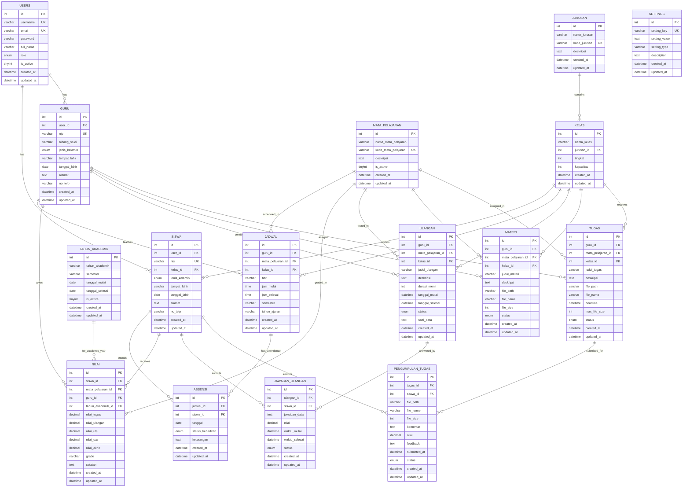

# ERD (Entity Relationship Diagram) - E-Learning SMK

## Entity Relationship Diagram

## Deskripsi ERD

### Core Entities (Entitas Utama)

#### 1. USERS
- **Primary Key**: id
- **Unique Keys**: username, email
- **Attributes**: password, full_name, role (admin/guru/siswa), is_active
- **Purpose**: Menyimpan data autentikasi dan informasi dasar user

#### 2. JURUSAN
- **Primary Key**: id
- **Unique Key**: kode_jurusan
- **Attributes**: nama_jurusan, deskripsi
- **Purpose**: Menyimpan data jurusan/program studi

#### 3. KELAS
- **Primary Key**: id
- **Foreign Key**: jurusan_id → JURUSAN.id
- **Attributes**: nama_kelas, tingkat, kapasitas
- **Purpose**: Menyimpan data kelas dalam setiap jurusan

#### 4. SISWA
- **Primary Key**: id
- **Foreign Keys**: user_id → USERS.id, kelas_id → KELAS.id
- **Unique Key**: nis
- **Attributes**: jenis_kelamin, tempat_lahir, tanggal_lahir, alamat, no_telp
- **Purpose**: Menyimpan data detail siswa

#### 5. GURU
- **Primary Key**: id
- **Foreign Key**: user_id → USERS.id
- **Unique Key**: nip
- **Attributes**: bidang_studi, jenis_kelamin, tempat_lahir, tanggal_lahir, alamat, no_telp
- **Purpose**: Menyimpan data detail guru

### Academic Entities (Entitas Akademik)

#### 6. TAHUN_AKADEMIK
- **Primary Key**: id
- **Attributes**: tahun_akademik, semester, tanggal_mulai, tanggal_selesai, is_active
- **Purpose**: Menyimpan data tahun akademik dan semester

#### 7. MATA_PELAJARAN
- **Primary Key**: id
- **Unique Key**: kode_mata_pelajaran
- **Attributes**: nama_mata_pelajaran, deskripsi, is_active
- **Purpose**: Menyimpan data mata pelajaran

#### 8. JADWAL
- **Primary Key**: id
- **Foreign Keys**: guru_id → GURU.id, mata_pelajaran_id → MATA_PELAJARAN.id, kelas_id → KELAS.id
- **Attributes**: hari, jam_mulai, jam_selesai, semester, tahun_ajaran
- **Purpose**: Menyimpan jadwal pembelajaran

### Assessment Entities (Entitas Penilaian)

#### 9. ABSENSI
- **Primary Key**: id
- **Foreign Keys**: jadwal_id → JADWAL.id, siswa_id → SISWA.id
- **Attributes**: tanggal, status_kehadiran, keterangan
- **Purpose**: Menyimpan data kehadiran siswa

#### 10. NILAI
- **Primary Key**: id
- **Foreign Keys**: siswa_id → SISWA.id, mata_pelajaran_id → MATA_PELAJARAN.id, guru_id → GURU.id, tahun_akademik_id → TAHUN_AKADEMIK.id
- **Attributes**: nilai_tugas, nilai_ulangan, nilai_uts, nilai_uas, nilai_akhir, grade, catatan
- **Purpose**: Menyimpan data nilai siswa

#### 11. ULANGAN
- **Primary Key**: id
- **Foreign Keys**: guru_id → GURU.id, mata_pelajaran_id → MATA_PELAJARAN.id, kelas_id → KELAS.id
- **Attributes**: judul_ulangan, deskripsi, durasi_menit, tanggal_mulai, tanggal_selesai, status, soal_data
- **Purpose**: Menyimpan data ulangan online

#### 12. JAWABAN_ULANGAN
- **Primary Key**: id
- **Foreign Keys**: ulangan_id → ULANGAN.id, siswa_id → SISWA.id
- **Attributes**: jawaban_data, nilai, waktu_mulai, waktu_selesai, status
- **Purpose**: Menyimpan jawaban dan hasil ulangan siswa

### Content Entities (Entitas Konten)

#### 13. MATERI
- **Primary Key**: id
- **Foreign Keys**: guru_id → GURU.id, mata_pelajaran_id → MATA_PELAJARAN.id, kelas_id → KELAS.id
- **Attributes**: judul_materi, deskripsi, file_path, file_name, file_size, status
- **Purpose**: Menyimpan data materi pembelajaran

#### 14. TUGAS
- **Primary Key**: id
- **Foreign Keys**: guru_id → GURU.id, mata_pelajaran_id → MATA_PELAJARAN.id, kelas_id → KELAS.id
- **Attributes**: judul_tugas, deskripsi, file_path, file_name, deadline, max_file_size, status
- **Purpose**: Menyimpan data tugas yang diberikan guru

#### 15. PENGUMPULAN_TUGAS
- **Primary Key**: id
- **Foreign Keys**: tugas_id → TUGAS.id, siswa_id → SISWA.id
- **Attributes**: file_path, file_name, file_size, komentar, nilai, feedback, submitted_at, status
- **Purpose**: Menyimpan data pengumpulan tugas siswa

### System Entities (Entitas Sistem)

#### 16. SETTINGS
- **Primary Key**: id
- **Unique Key**: setting_key
- **Attributes**: setting_value, setting_type, description
- **Purpose**: Menyimpan konfigurasi sistem

### Key Relationships (Relasi Utama)

1. **USERS → SISWA/GURU**: One-to-Many (satu user bisa menjadi siswa atau guru)
2. **JURUSAN → KELAS**: One-to-Many (satu jurusan memiliki banyak kelas)
3. **KELAS → SISWA**: One-to-Many (satu kelas memiliki banyak siswa)
4. **GURU → JADWAL**: One-to-Many (satu guru mengajar di banyak jadwal)
5. **MATA_PELAJARAN → JADWAL**: One-to-Many (satu mata pelajaran dijadwalkan berkali-kali)
6. **ULANGAN → JAWABAN_ULANGAN**: One-to-Many (satu ulangan dijawab oleh banyak siswa)
7. **TUGAS → PENGUMPULAN_TUGAS**: One-to-Many (satu tugas dikumpulkan oleh banyak siswa)

### Database Constraints

- **Foreign Key Constraints**: Semua relasi menggunakan foreign key dengan CASCADE untuk integritas data
- **Unique Constraints**: Username, email, NIS, NIP, dan kode jurusan/mata pelajaran harus unik
- **Check Constraints**: Role harus admin/guru/siswa, jenis_kelamin harus L/P
- **Indexes**: Primary keys dan foreign keys di-index untuk performa optimal
