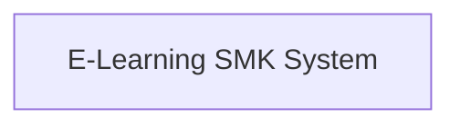
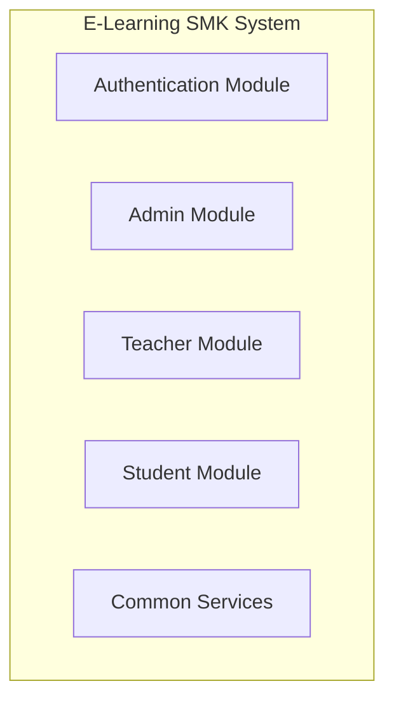
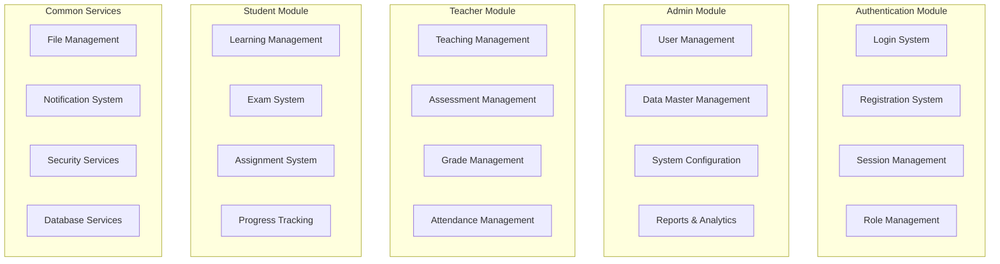
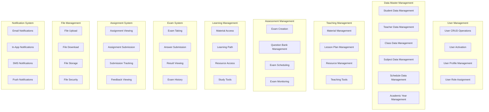
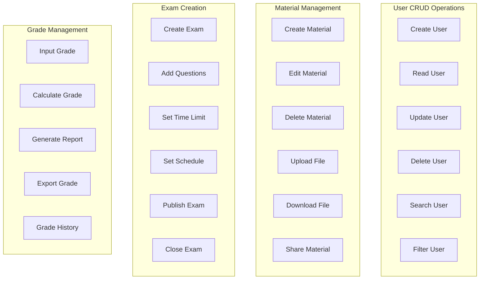

# Diagram Berjenjang - E-Learning SMK

## Level 0 - System Overview

## Level 1 - Main Modules

## Level 2 - Detailed Modules

## Level 3 - Sub-modules Detail

## Level 4 - Component Level

## Hierarchical Structure Summary

### Level 0: System Overview
- **E-Learning SMK System**: Sistem utama e-learning untuk SMK

### Level 1: Main Modules
1. **Authentication Module**: Sistem autentikasi dan otorisasi
2. **Admin Module**: Modul untuk administrator
3. **Teacher Module**: Modul untuk guru/pengajar
4. **Student Module**: Modul untuk siswa
5. **Common Services**: Layanan umum yang digunakan semua modul

### Level 2: Detailed Modules
- **Authentication**: Login, Register, Session, Role
- **Admin**: User Management, Data Master, System Config, Reports
- **Teacher**: Teaching, Assessment, Grade, Attendance
- **Student**: Learning, Exam, Assignment, Progress
- **Common**: File, Notification, Security, Database

### Level 3: Sub-modules
- **User Management**: CRUD, Activation, Profile, Role Assignment
- **Data Master**: Student, Teacher, Class, Subject, Schedule, Academic Year
- **Teaching**: Material, Lesson Plan, Resource, Tools
- **Assessment**: Creation, Question Bank, Scheduling, Monitoring
- **Learning**: Access, Path, Resource, Tools
- **Exam**: Taking, Submission, Results, History
- **Assignment**: Viewing, Submission, Tracking, Feedback
- **File**: Upload, Download, Storage, Security
- **Notification**: Email, In-App, SMS, Push

### Level 4: Component Level
- **User CRUD**: Create, Read, Update, Delete, Search, Filter
- **Material**: Create, Edit, Delete, Upload, Download, Share
- **Exam**: Create, Add Questions, Set Time, Set Schedule, Publish, Close
- **Grade**: Input, Calculate, Generate Report, Export, History

## Benefits of Hierarchical Structure

1. **Modularity**: Setiap level memiliki tanggung jawab yang jelas
2. **Scalability**: Mudah untuk menambah fitur baru di level yang sesuai
3. **Maintainability**: Perubahan di satu level tidak mempengaruhi level lain
4. **Reusability**: Komponen di level bawah dapat digunakan ulang
5. **Testing**: Mudah untuk melakukan unit testing pada setiap level
6. **Documentation**: Struktur yang jelas memudahkan dokumentasi
