# Use Case Diagram - E-Learning SMK

```mermaid
graph TB
    %% Actors
    Admin[👨‍💼 Admin]
    Guru[👨‍🏫 Guru]
    Siswa[👨‍🎓 Siswa]
    
    %% System Boundary
    subgraph "E-Learning SMK System"
        %% Admin Use Cases
        subgraph "Admin Functions"
            UC1[User Activation]
            UC2[User Management]
            UC3[System Settings]
            UC4[Data Master Management]
            UC5[Student Data Management]
            UC6[Teacher Data Management]
            UC7[Class Management]
            UC8[Schedule Management]
            UC9[Attendance Management]
            UC10[Grade Management]
            UC11[Exam Management]
            UC12[Material Management]
            UC13[Assignment Management]
            UC14[Academic Year Management]
        end
        
        %% Guru Use Cases
        subgraph "Teacher Functions"
            UC15[View Student Data]
            UC16[View Class Data]
            UC17[Attendance Management]
            UC18[Grade Input]
            UC19[Create Online Exam]
            UC20[Material Management]
            UC21[Assignment Management]
            UC22[View Exam Results]
        end
        
        %% Siswa Use Cases
        subgraph "Student Functions"
            UC23[View Schedule]
            UC24[View Grades]
            UC25[Take Online Exam]
            UC26[View Materials]
            UC27[Submit Assignments]
            UC28[View Exam Results]
        end
        
        %% Common Use Cases
        subgraph "Common Functions"
            UC29[Login]
            UC30[Register]
            UC31[Logout]
            UC32[Profile Management]
        end
    end
    
    %% Admin Relationships
    Admin --> UC1
    Admin --> UC2
    Admin --> UC3
    Admin --> UC4
    Admin --> UC5
    Admin --> UC6
    Admin --> UC7
    Admin --> UC8
    Admin --> UC9
    Admin --> UC10
    Admin --> UC11
    Admin --> UC12
    Admin --> UC13
    Admin --> UC14
    Admin --> UC29
    Admin --> UC31
    Admin --> UC32
    
    %% Guru Relationships
    Guru --> UC15
    Guru --> UC16
    Guru --> UC17
    Guru --> UC18
    Guru --> UC19
    Guru --> UC20
    Guru --> UC21
    Guru --> UC22
    Guru --> UC29
    Guru --> UC31
    Guru --> UC32
    
    %% Siswa Relationships
    Siswa --> UC23
    Siswa --> UC24
    Siswa --> UC25
    Siswa --> UC26
    Siswa --> UC27
    Siswa --> UC28
    Siswa --> UC29
    Siswa --> UC30
    Siswa --> UC31
    Siswa --> UC32
    
    %% Include Relationships
    UC1 -.->|includes| UC29
    UC2 -.->|includes| UC29
    UC3 -.->|includes| UC29
    UC4 -.->|includes| UC29
    UC5 -.->|includes| UC29
    UC6 -.->|includes| UC29
    UC7 -.->|includes| UC29
    UC8 -.->|includes| UC29
    UC9 -.->|includes| UC29
    UC10 -.->|includes| UC29
    UC11 -.->|includes| UC29
    UC12 -.->|includes| UC29
    UC13 -.->|includes| UC29
    UC14 -.->|includes| UC29
    UC15 -.->|includes| UC29
    UC16 -.->|includes| UC29
    UC17 -.->|includes| UC29
    UC18 -.->|includes| UC29
    UC19 -.->|includes| UC29
    UC20 -.->|includes| UC29
    UC21 -.->|includes| UC29
    UC22 -.->|includes| UC29
    UC23 -.->|includes| UC29
    UC24 -.->|includes| UC29
    UC25 -.->|includes| UC29
    UC26 -.->|includes| UC29
    UC27 -.->|includes| UC29
    UC28 -.->|includes| UC29
    
    %% Extend Relationships
    UC30 -.->|extends| UC29
    UC32 -.->|extends| UC29
```

## Deskripsi Use Cases

### Admin Use Cases
- **UC1 - User Activation**: Mengaktifkan/menonaktifkan user
- **UC2 - User Management**: Mengelola data pengguna
- **UC3 - System Settings**: Mengatur pengaturan sistem
- **UC4 - Data Master Management**: Mengelola data master
- **UC5 - Student Data Management**: CRUD data siswa
- **UC6 - Teacher Data Management**: CRUD data guru
- **UC7 - Class Management**: CRUD data kelas
- **UC8 - Schedule Management**: CRUD data jadwal
- **UC9 - Attendance Management**: CRUD data absensi
- **UC10 - Grade Management**: CRUD data nilai
- **UC11 - Exam Management**: CRUD data ulangan
- **UC12 - Material Management**: CRUD data materi
- **UC13 - Assignment Management**: CRUD data tugas
- **UC14 - Academic Year Management**: CRUD data tahun akademik

### Teacher Use Cases
- **UC15 - View Student Data**: Melihat data siswa (read-only)
- **UC16 - View Class Data**: Melihat data kelas (read-only)
- **UC17 - Attendance Management**: CRUD data absensi
- **UC18 - Grade Input**: Input dan kelola nilai
- **UC19 - Create Online Exam**: Membuat soal ulangan online
- **UC20 - Material Management**: CRUD data materi
- **UC21 - Assignment Management**: CRUD data tugas
- **UC22 - View Exam Results**: Melihat hasil ulangan

### Student Use Cases
- **UC23 - View Schedule**: Melihat jadwal pembelajaran
- **UC24 - View Grades**: Melihat nilai
- **UC25 - Take Online Exam**: Mengikuti ulangan online
- **UC26 - View Materials**: Melihat dan download materi
- **UC27 - Submit Assignments**: Mengumpulkan tugas
- **UC28 - View Exam Results**: Melihat hasil ulangan

### Common Use Cases
- **UC29 - Login**: Masuk ke sistem
- **UC30 - Register**: Daftar akun baru
- **UC31 - Logout**: Keluar dari sistem
- **UC32 - Profile Management**: Mengelola profil pribadi
